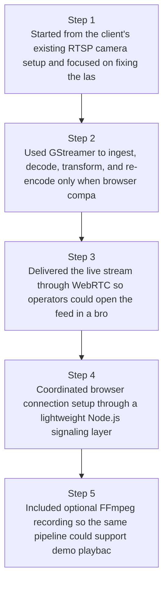
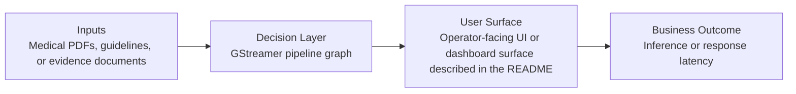
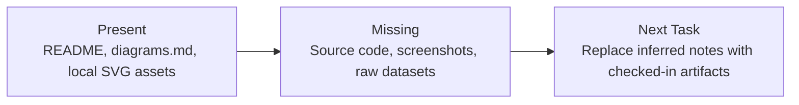

# RTSP Camera Browser Streaming Diagrams

Generated on 2026-04-26T04:29:37Z from README narrative plus project blueprint requirements.

## RTSP to WebRTC pipeline

## GStreamer pipeline graph

## Evidence Gap Map

